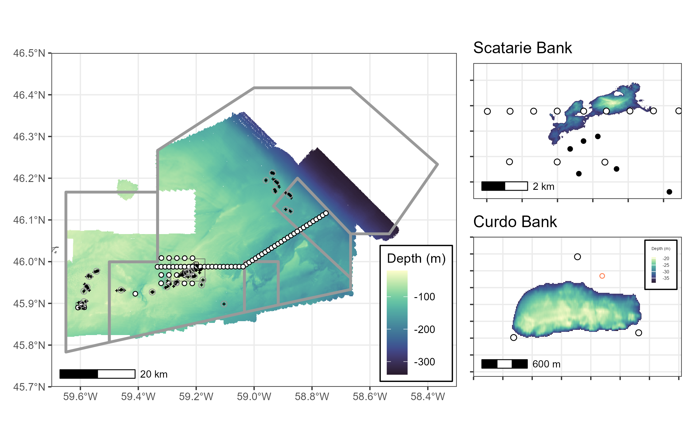
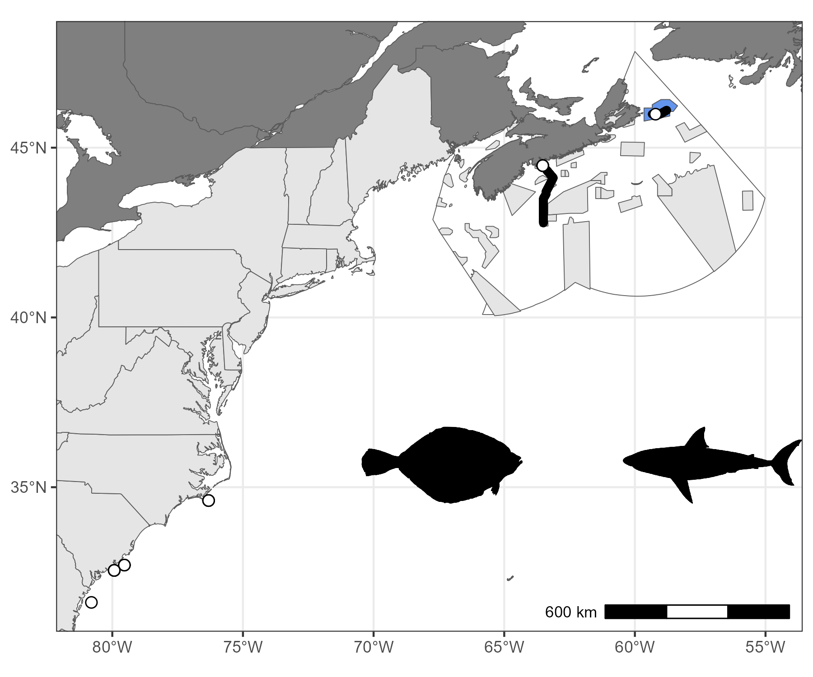
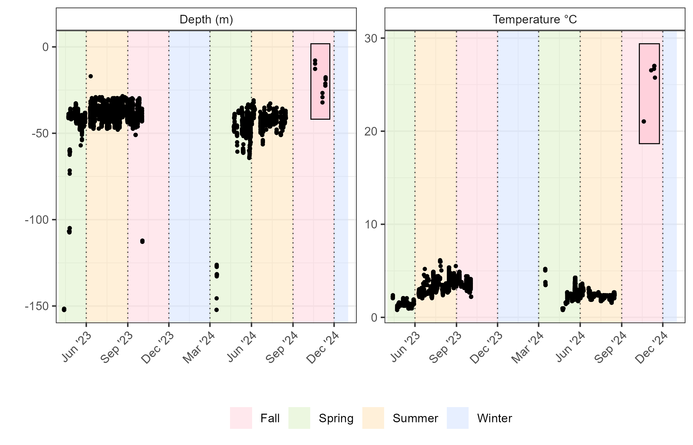

# stannsbank
St. Anns Bank Marine Protected Area Science Program

__Fig 1.__ St. Anns Bank Marine Protected Area. Fill colours correspond to benthoscape classes [(Lacharite and Brown 2018)](https://onlinelibrary.wiley.com/doi/full/10.1002/aqc.3074). Points correspond to the proposed environmental DNA sampling program (eDNA) and locations for potential deployment of a mid-water camera system in summer 2023. 

__Fig 2.__ St. Anns Bank Acoustic Program [__SABMPA__](https://members.oceantrack.org/project?ccode=SABMPA). Proposed start locations for the 2026-2030 fish tagging locations within the St Anns Bank MPA. White circles denote locations of the Acoustic receivers, with insets showing zoomed in views of focal banks (Scatarie and Curdo) with depths restricted to 35m and shallower. Crosses denote previous sampling locations and grey circles denote centroid of tag location clusters, reported in Table 1. Bathymetry based on available multibeam datasets processed by the Canadian Hydrographic Service [CHS NONNA](https://charts.gc.ca/data-gestion/nonna/index-eng.html). 

__Fig 3.__ St. Anns Bank Marine Protected Area. Monthly average bottom temperature from 48 acoustic telemetry stations deployed as two linear arrays (North and South) in 2015 to 2021 and one long array in 2021 to 2022 (OTN2021).

__Fig 4.__ Map depicting sample collection locations from the PER-2023-757 mission on board the CCGS M. Perley. Extent of second panel depicted by dashed line in first. Fill colours correspond to benthoscape classification for the St. Anns Bank MPA [(Lacharite and Brown 2018)](https://onlinelibrary.wiley.com/doi/full/10.1002/aqc.3074).

__Fig 5.__ Proposed sampling locations for the 2024 Mission to St. Anns Bank (PER-2024-885)

__Fig 6.__ Multibeam coverage for St Anns Bank. Inset plots of Curdo and Scatarie Bank show 40m isobath. 

__Fig 7.__ Location of detection for Atlantic halibut. Relase location within St Anns Bank, later detections after predation likely by a white shark (see Figure 8). 

__Fig 8.__ Acoustic tag environmental log. Box depicts likely predation event due to increase in temperature and depth. 