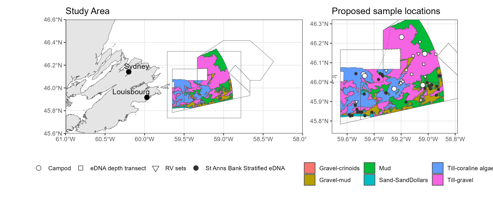
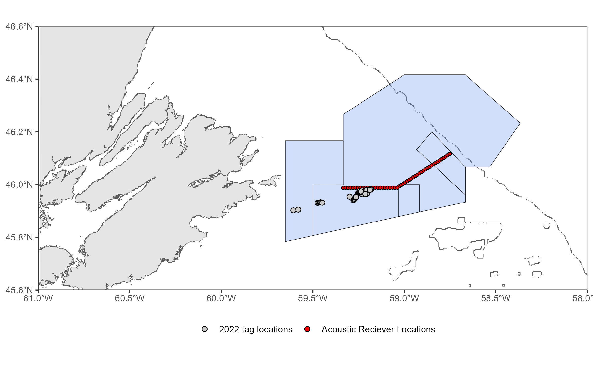
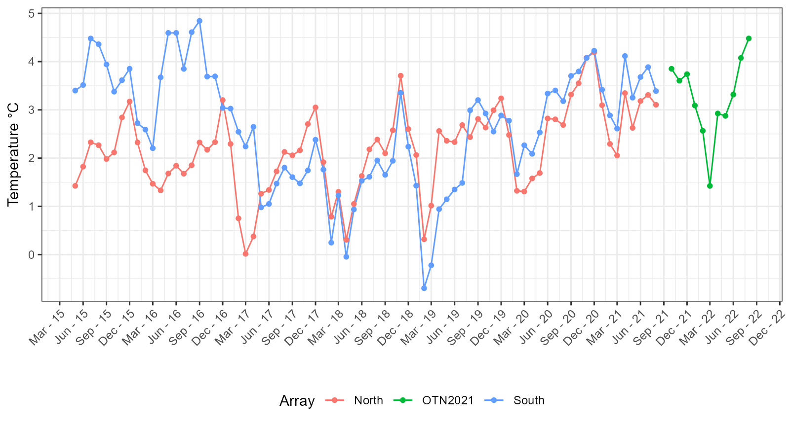
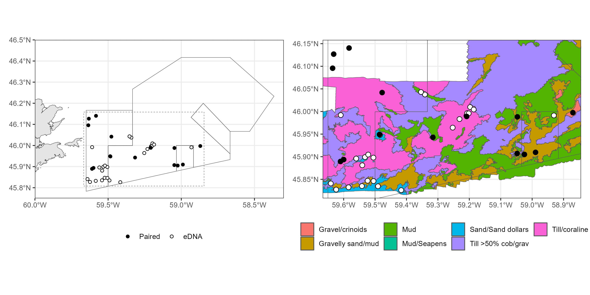
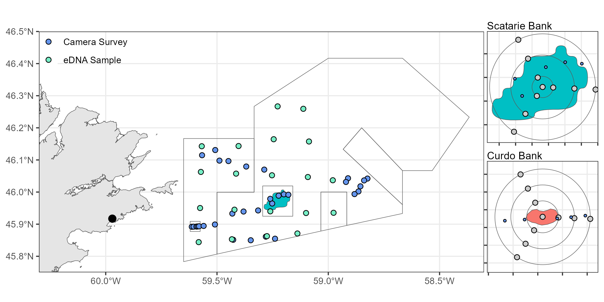
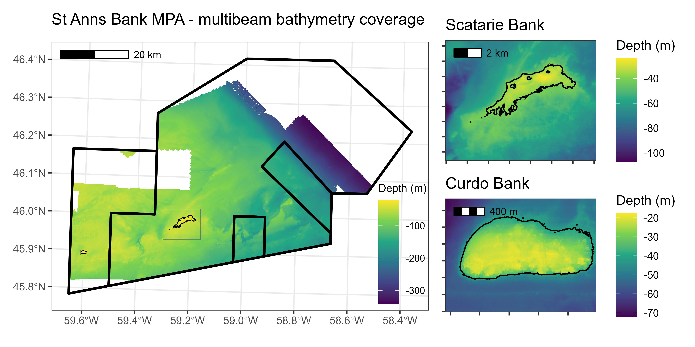

# stannsbank
St. Anns Bank Marine Protected Area Science Program

__Fig 1.__ St. Anns Bank Marine Protected Area. Fill colours correspond to benthoscape classes [(Lacharite and Brown 2018)](https://onlinelibrary.wiley.com/doi/full/10.1002/aqc.3074). Points correspond to the proposed environmental DNA sampling program (eDNA) and locations for potential deployment of a mid-water camera system in summer 2023. 

__Fig 2.__ St. Anns Bank Marine Protected Area. Deployed receiver tag locations (Atlantic cod and Atlantic Halibut) from the 2022 field season. Grey line denotes the 250m isobath.

__Fig 3.__ St. Anns Bank Marine Protected Area. Monthly average bottom temperature from 48 acoustic telemetry stations deployed as two linear arrays (North and South) in 2015 to 2021 and one long array in 2021 to 2022 (OTN2021).

__Fig 4.__ Map depicting sample collection locations from the PER-2023-757 mission on board the CCGS M. Perley. Extent of second panel depicted by dashed line in first. Fill colours correspond to benthoscape classification for the St. Anns Bank MPA [(Lacharite and Brown 2018)](https://onlinelibrary.wiley.com/doi/full/10.1002/aqc.3074).

__Fig 5.__ Proposed sampling locations for the 2024 Mission to St. Anns Bank (PER-2024-885)

__Fig 6.__ Multibeam coverage for St Anns Bank. Inset plots of Curdo and Scatarie Bank show 40m isobath. 