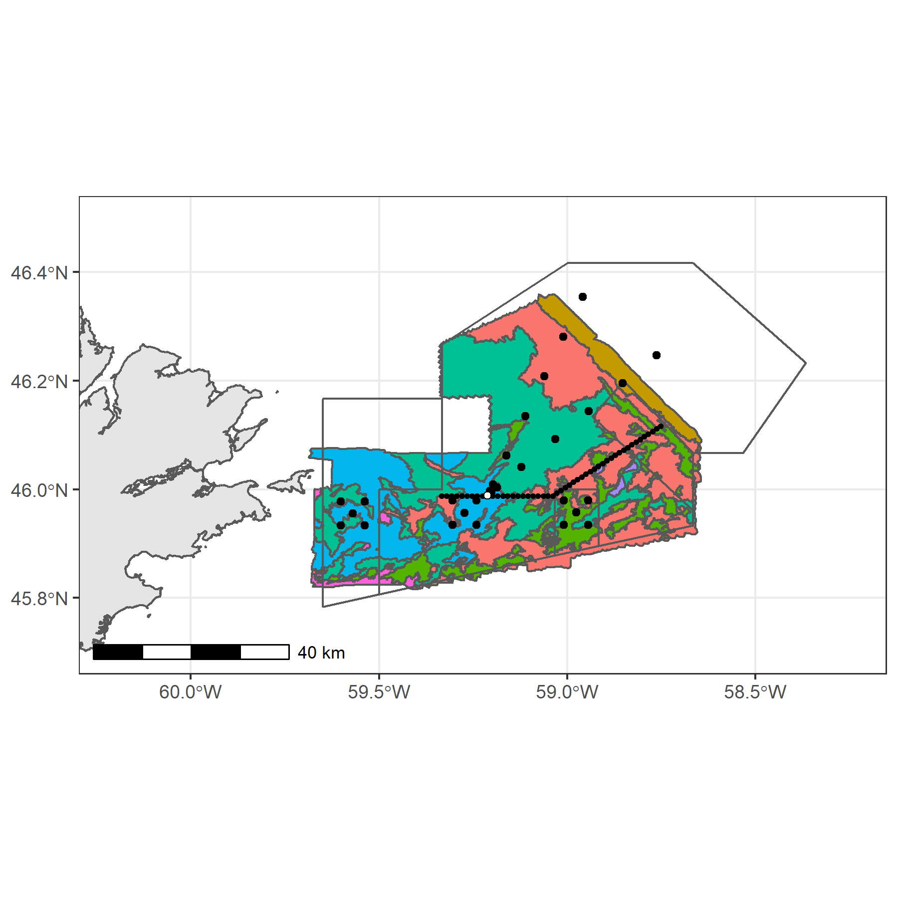

# stannsbank
St. Anns Bank Marine Protected Area Science Program

__Fig 1.__ St. Anns Bank Marine Protected Area. Fill colours correspond to benthoscape classes [(Lacharite and Brown 2018)](https://onlinelibrary.wiley.com/doi/full/10.1002/aqc.3074). Cirlces correspond to the proposed environmental DNA sampling program (eDNA) and small crosses correspond to the array of acoustic receivers deployed for tracking fish movement [Ocean Tracking Network - SABMPA](https://members.oceantrack.org/project?ccode=SABMPA). White dot denotes Scatterie Bank. 