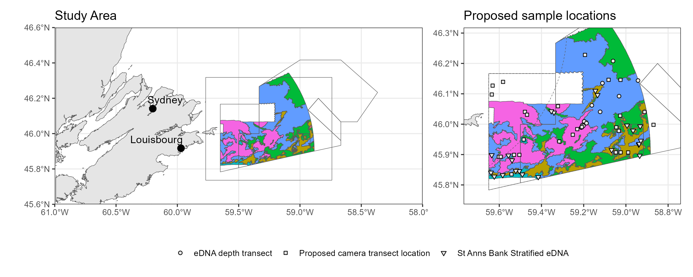

# stannsbank
St. Anns Bank Marine Protected Area Science Program

__Fig 1.__ St. Anns Bank Marine Protected Area. Fill colours correspond to benthoscape classes [(Lacharite and Brown 2018)](https://onlinelibrary.wiley.com/doi/full/10.1002/aqc.3074). Points correspond to the proposed environmental DNA sampling program (eDNA) and locations for potential deployment of a mid-water camera system in summer 2023. 